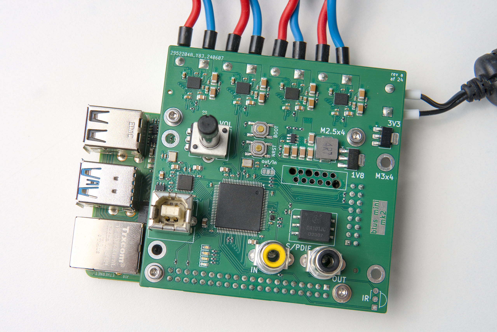
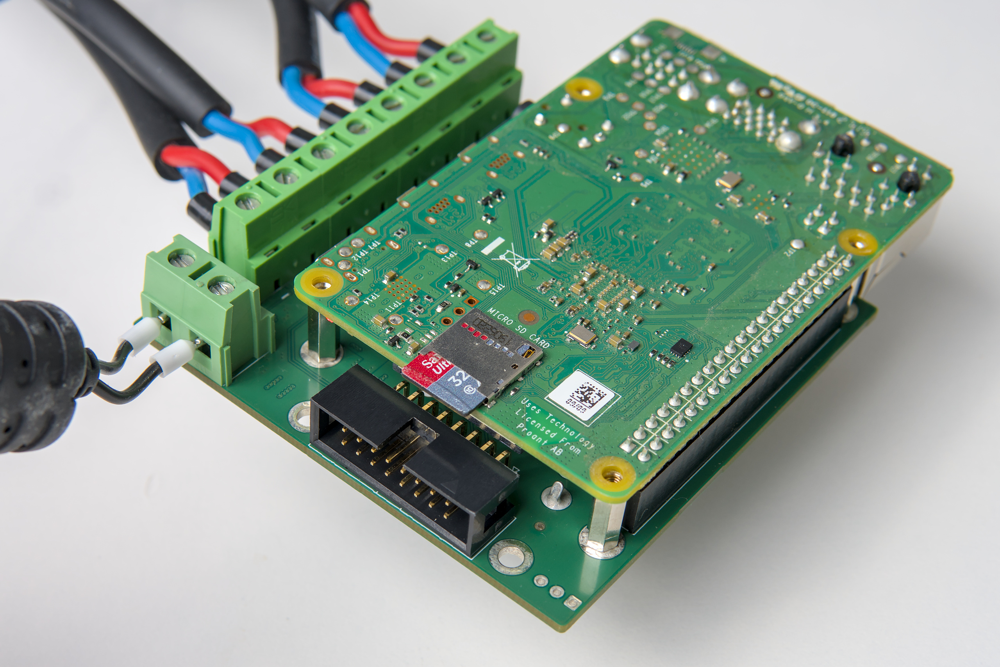

# Blus mini

This small amplifier is ideally suited for stereo pairs of two-way speakers.

Find the [hardware design files](./kicad/) for reference.
It is required to flash the corresponding [firmware]((https://github.com/blus-audio/firmware-rs)).

## Features

- Source switching, digital signal processing, and more on a powerful STM32H723
- 4x25 W Class-D amplifiers - the [TI TAS2780](https://www.ti.com/product/TAS2780)
- USB Audio interface (UAC 1.0) with up to 48 kHz/32 bit audio
- Raspberry Pi header for direct I2S audio streaming
- S/PDIF input and output
- Auxiliary I2S input or output
- Full 32 bit digital audio chain with analog conversion only in the amplifiers

## State of development

The amplifier has been fully tested for an extended period of time.
